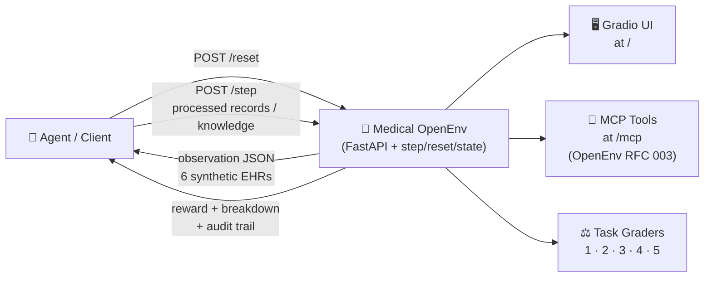
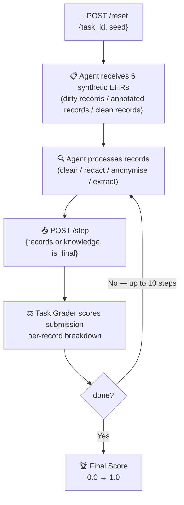

# Medical Records Data Cleaner & PII Redactor v3

[](https://github.com/openenv/rfc)
[](https://opensource.org/licenses/MIT)
[](https://github.com/olivespecs/medflow-v3-env/actions/workflows/ci.yml)

A high-fidelity healthcare AI training environment for medical record cleaning, PHI redaction, and clinical knowledge extraction. This environment implements the **OpenEnv** standard for RL-compatible medical data processing.

> 🔴 **Live Demo:** Deploy on Hugging Face Spaces using the bundled `Dockerfile`.

| Tab | What It Shows |
|---|---|
| 🎮 **Pipeline** | Select task + seed + agent → run the hybrid baseline → compare original vs. processed records side-by-side |
| 📊 **Evaluation** | Final score, PHI leak count, clinical utility retention, downstream ML fidelity |
| 📋 **Benchmark** | Hybrid baseline vs. GPT-4o on the same task — see score difference instantly |
| 📤 **FHIR Export** | Export processed records as FHIR-compliant JSON for downstream system testing |

---

Every healthcare AI team must clean, de-identify, and extract structured knowledge from patient records before using them for training or analytics. This is a multi-step, high-stakes cognitive pipeline — and no RL environment has modeled it at this level before.

**Medical Records OpenEnv simulates the full workflow:**

1. The agent receives a batch of **6 synthetic patient records** containing deliberate flaws, embedded PHI, and adversarial re-identification traps
2. The agent must **process** the records according to the selected task — fix data quality issues, redact identifiers, anonymise demographics, or extract clinical entities
3. The agent **submits** its processed records and receives a **dense reward signal** with per-record breakdowns
4. The agent can **iterate** up to 10 steps per episode, refining its output with each step

This is NOT a toy environment. It models a genuine clinical data engineering workflow with realistic EHR structures, realistic PHI patterns, and adversarial privacy attacks. An agent that masters all 5 tasks would have direct value in healthcare AI automation.




| Component | Technology | Purpose |
|---|---|---|
| **Environment** | FastAPI + Uvicorn | OpenEnv-compliant episode management, grading, and reward computation |
| **Baseline Agent** | Rules + optional Transformer NER | Hybrid deterministic agent with graceful rule-only fallback |
| **Similarity Scoring** | SentenceTransformers + BERTScore + Jaccard fallback | Semantic summary grading with deterministic fallback when ML deps are absent |
| **Data Generator** | Faker (seeded) | Synthetic EHR generation with injected flaws and PHI annotations |
| **Gradio UI** | Gradio Blocks | Interactive exploration, benchmarking, and FHIR export |
| **MCP Server** | FastMCP | OpenEnv RFC 003 tool interface for agents |

---



---

## Observation Space

The observation is a JSON object containing everything the agent needs to process the current batch:

| Field | Type | Description |
|---|---|---|
| `task_id` | `int` | Current task (1–5) |
| `task_description` | `str` | Full task description with requirements and scoring formula |
| `records` | `list[dict]` | 6 synthetic patient records (dirty / annotated / clean depending on task) |
| `step` | `int` | Current step number in the episode |
| `max_steps` | `int` | Maximum allowed steps (10) |
| `metadata` | `dict` | Seed, record count, and task-specific hints |

Records are serialized `PatientRecord` objects with these fields (some hidden from agent):

| Field | Agent Sees? | Description |
|---|---|---|
| `record_id` | ✅ | Unique record identifier |
| `mrn` | ✅ | Medical Record Number (may contain PHI) |
| `patient_name` | ✅ | Patient name (may contain PHI) |
| `dob` | ✅ | Date of birth (ISO 8601 or malformed in Task 1) |
| `gender` | ✅ | Gender (may be inconsistent in Task 1) |
| `phone` / `email` / `address` | ✅ | Contact fields (may be missing or PHI) |
| `icd10_codes` | ✅ | Diagnosis codes (may be invalid in Task 1) |
| `vitals` | ✅ | HR, BP, temp, weight, height |
| `medications` | ✅ | Name, dose, frequency (may have bad units in Task 1) |
| `clinical_notes` | ✅ | Free-text notes (PHI embedded in Tasks 2 & 3) |
| `phi_tokens` | ❌ hidden | Ground-truth PHI annotations (Tasks 2 & 3) |
| `adversarial_identifiers` | ❌ hidden | Re-identification traps (Task 3 only) |
| `injected_flaws` | ❌ hidden | Flaw list for scoring (Task 1) |

## Action Space

Actions are JSON payloads submitted to `POST /step`. The shape differs by task:

**Tasks 1–3 — Record submission:**
```json
{
  "records": [
    {
      "record_id": "...",
      "patient_name": "[REDACTED_NAME]",
      "mrn": "[REDACTED_MRN]",
      "dob": "1967-03-22",
      "icd10_codes": ["E11.9", "I10"],
      "clinical_notes": "Patient presents with...",
      "..."
    }
  ],
  "is_final": true
}
```

**Task 4 — Knowledge submission (index-aligned, no record_id):**
```json
{
  "knowledge": [
    {
      "entities": [
        {"text": "Type 2 diabetes", "type": "Condition", "code": "E11.9"},
        {"text": "Metformin",       "type": "Medication", "code": "Metformin"}
      ],
      "summary": "57-year-old male with diagnoses: E11.9, I10 on medications: Metformin 500 mg twice daily. Vitals: BP 138/88 mmHg, HR 82 bpm."
    }
  ],
  "is_final": true
}
```

## Reward Function — Dense, Per-Record Signals with Incremental Shaping

Unlike binary pass/fail environments, **every step provides informative reward at both the record and aggregate level**:

| Task | Base Reward Formula | Pass Bar |
|---|---|---|
| **Task 1** | `per_field_avg × 0.8 + longitudinal_consistency × 0.2` | score ≥ 0.85 |
| **Task 2** | `phi_score × 0.6 + utility_score × 0.4` | phi_score = 1.0 AND utility ≥ 0.80 |
| **Task 3** | `avg_phi × 0.4 + avg_ml × 0.3 + avg_fidelity × 0.2 + k_score × 0.1` | phi_score = 1.0 AND ml_utility_score ≥ 0.60 |
| **Task 4** | `entity_extraction × 0.4 + code_precision × 0.3 + summary_fidelity × 0.3` | entity ≥ 0.75 AND summary ≥ 0.50 |

### Incremental Reward Shaping (All Tasks)

To encourage learning and discourage random actions, rewards include **incremental shaping**:

```python
shaped_score = base_score + improvement_bonus + step_penalty
```

Where:
- **base_score**: Raw task performance score [0.0, 1.0]
- **improvement_bonus**: +0.0 to +0.05 for improvements over previous step (10% of gain, capped)
- **step_penalty**: -0.01 per step to discourage aimless actions
- **regression_penalty**: -0.0 to -0.025 for worse performance than previous step (10% of loss, capped)

**Example:** If your baseline score is 0.60 and you improve to 0.70:
- Base: 0.70
- Improvement bonus: min(0.1 × 0.10, 0.05) = +0.01
- Step penalty: -0.01
- **Final shaped reward**: 0.70

This provides dense feedback every step while maintaining the same optimal policy.

## State Space

State is available via GET /state using episode_id from POST /reset.

| Field | Type | Description |
|---|---|---|
| task_id | int | Current task id (1-5) |
| seed | int | Seed used for deterministic generation |
| step | int | Current step in episode |
| max_steps | int | Step limit for this episode |
| done | bool | Whether the episode has terminated |
| last_score | float or null | Most recent raw grader score |
| last_breakdown | dict | Most recent component-level grading breakdown |
| passed | bool | Whether current submission satisfies task pass bar |
| audit_trail | list[dict] | Per-step trace with score, shaped score, improvement, and pass status |

## Episode Structure

1. POST /reset creates a new episode and returns episode_id with initial observation.
2. POST /step submits records or knowledge for that same episode_id.
3. Repeat step until done=true or submit is_final=true.
4. GET /state inspects server-side status and audit trail.
5. GET /grader re-grades the last submission without changing state.
6. GET /export returns state plus reward_trend for replay/debugging.


---

Each task is a complete EHR processing challenge with 6 synthetic patient records generated from a fixed seed:

### Task 1 — Data Hygiene & Standardisation *(Easy)*
- **What it does:** Fix deliberate data-quality flaws injected into longitudinal records (3 patients × 2 visits)
- **Flaw types:** Mixed date formats, invalid ICD-10 codes, wrong medication units (mcg vs mg), missing fields, OCR noise in names and codes, inconsistent DOB/gender across visits for the same MRN
- **Challenge:** Must resolve longitudinal inconsistencies using majority vote across visits — per-field fixes alone are not enough
- **Grader threshold:** `score ≥ 0.85`

| Flaw | Example |
|---|---|
| Bad date format | `"01/15/1990"`, `"15 January 1990"`, `"1990/01/15"` |
| Invalid ICD-10 | `"Z99.999"`, OCR-corrupted `"E11.q"` |
| Wrong medication unit | `"500 mcg twice daily"` instead of `mg` |
| Missing field | `phone = null` |
| OCR noise | `"J0hn Sm1th"` |
| Longitudinal inconsistency | Same MRN, visit 2 has flipped gender or shifted DOB |

### Task 2 — PHI Detection & Redaction *(Medium)*
- **What it does:** Locate and replace all Protected Health Information with typed tokens, preserving all clinical content
- **PHI scope:** 6 categories across structured fields AND free-text clinical notes
- **Challenge:** PHI is embedded informally in notes (`"Pt. Smith reported..."`, `"Contact email: user@..."`) — regex on structured fields alone will miss 30–40% of leaks
- **Grader threshold:** `phi_score == 1.0 AND utility_score ≥ 0.80`

| PHI Category | Required Token |
|---|---|
| Patient name | `[REDACTED_NAME]` |
| Medical Record Number | `[REDACTED_MRN]` |
| Date of Birth | `[REDACTED_DOB]` |
| Phone number | `[REDACTED_PHONE]` |
| Email address | `[REDACTED_EMAIL]` |
| Street address | `[REDACTED_ADDRESS]` |

### Task 3 — Full Anonymisation + Downstream Utility *(Hard)*
- **What it does:** Fully de-identify records while keeping enough clinical signal for a deterministic disease-risk model to remain accurate
- **Beyond Task 2:** Also replace exact DOB with age-group buckets (`18-40`, `41-60`, `61-75`, `76+`), and scrub **adversarial indirect identifiers** hidden in clinical notes (rare disease + ZIP code combinations that enable linkage attacks)
- **k-anonymity:** Achieve k=2 on quasi-identifiers (age-group, gender, address prefix)
- **Challenge:** Adversarial identifiers look like innocent clinical notes — removing them requires contextual understanding, not just regex
- **Grader threshold:** `phi_score == 1.0 AND ml_utility_score ≥ 0.60`

> The mock disease-risk model is a **fully deterministic, code-based scorer** using age-group, ICD-10 chapter prefix, and medication names. No ML inference at grading time — results are 100% reproducible.

### Task 4 — Clinical Knowledge Extraction *(Hard)*
- **What it does:** Extract structured clinical entities (conditions + medications with codes) and write a comprehensive narrative summary for each record
- **Graded against:** A structured reference abstract built from ICD-10 codes, medications, and vitals (not raw notes).
- **Challenge:** Requires understanding which entities are clinically meaningful and generating a comprehensive, accurate summary without simply copying the input.
- **Grader threshold:** `entity_extraction ≥ 0.75 AND summary_fidelity ≥ 0.50`

### Task 5 — Contextual PII Disambiguation *(Expert)*
- **What it does:** Advanced clinical reasoning challenge requiring nuanced understanding of context-dependent PII. Same strings may appear as both patient and provider identifiers (e.g., "Dr. Smith saw Mr. Smith" — only redact "Mr. Smith").
- **Key challenge:** Distinguish between:
  - **Patient identifiers** (redact): "Mr. Johnson", "Mrs. Smith", family members
  - **Provider identifiers** (preserve): "Dr. Johnson", "Nurse Smith", medical staff
  - **Facility names** (preserve): "Johnson Medical Center", "Smith Pharmaceuticals"
- **Graded on:** Three components:
  - **patient_phi_score** (50%): Correct redaction of patient/family identifiers
  - **provider_phi_score** (30%): Correct preservation of provider names
  - **contextual_accuracy** (20%): Proper handling of ambiguous surnames
- **Grader threshold:** `overall_score ≥ 0.70 AND patient_phi_score ≥ 0.80`
- **Why it matters:** Real-world EHR data contains ambiguous references that require contextual reasoning, not just pattern matching. This task tests genuine clinical NLP understanding.

---


### Judge Safety Badge
- The UI shows **Safe** only when a task meets its pass bar (e.g., Task 2/3 require `phi_score=1.0`; Task 5 requires `overall≥0.70` and `patient_phi_score≥0.80`).
- If a task fails its bar, the badge is **Unsafe**, even if individual metrics look good.

## Baseline Scores

Deterministic hybrid rule-based baseline (seed=42, no API key required):

> **Note:** The baseline agent **auto-enables the NER (ML) component** when `transformers` and `torch` are installed. 
> This produces the scores documented below. If ML dependencies are absent, it falls back to rule-only mode 
> (lower scores, especially for Tasks 2-5). Install with `pip install -r requirements.txt`.

| Task | Score | Pass Bar | Actual Metrics | Pass? | Notes |
|---|---|---|---|---|---|
| **Task 1 — Hygiene** | **0.96** | ≥ 0.85 | per_field_avg: 0.96, longitudinal_consistency: 1.0 | ✅ Pass | Regex + majority vote consensus |
| **Task 2 — Redaction** | **1.00** | phi=1.0 AND util≥0.8 | phi_score: 1.0, utility_score: 1.0 | ✅ Pass | Structured + notes regex + NER safety-net |
| **Task 3 — Anonymisation** | **0.95** | phi=1.0 AND ml≥0.6 | phi_score: 1.0, ml_utility_score: 0.90 | ✅ Pass | Age bucketing + improved adversarial scrubbing |
| **Task 4 — Knowledge** | **0.93** | entity≥0.75 AND sum≥0.50 | entity_extraction: 1.0, code_precision: 1.0, summary_fidelity: 0.78 | ✅ Pass | Enhanced template-based summary with clinical notes extraction |
| **Task 5 — Contextual PII** | **0.88** | overall≥0.70 AND patient≥0.80 | patient_phi: 1.0, provider_phi: 0.86, contextual: 0.70 | ✅ Pass | Context-aware reasoning with provider/patient disambiguation |


Scores are **deterministic** — same seed always produces the same synthetic records and the same baseline actions.

---

## API Endpoints

| Method | Endpoint | Description | Returns |
|---|---|---|---|
| `GET` | `/tasks` | List all tasks with descriptions, pass bars, and action schema | Task catalog |
| `POST` | `/reset` | `{"task_id": 1-5, "seed": 42}` — start a new episode | `{episode_id, observation}` |
| `POST` | `/step` | Submit `{records, is_final}` or `{knowledge, is_final}` with `?episode_id=` | `{observation, reward, done, info}` |
| `GET` | `/state` | Current episode snapshot with full audit trail | State dict |
| `GET` | `/export` | Full episode export — audit trail + `reward_trend` list for replay/debugging | Export dict |
| `GET` | `/grader` | Re-grade the last submission (idempotent) | Score + breakdown |
| `GET` | `/metrics` | Prometheus-style counters (episodes, steps, errors, rate-limit hits) | Metrics dict |
| `GET` | `/baseline` | Run the hybrid baseline across all 5 tasks (seed=42) | Results dict |
| `GET` | `/health` | Standard health check | `{"status": "healthy"}` |
| `GET` | `/health/detailed` | Health + NER + BERTScore + metrics + capacity | Detailed status |
| `GET` | `/mode` | Operation mode | `{"mode": "agentic"}` |
| `GET` | `/metadata` | Environment name and description | Metadata dict |
| `GET` | `/schema` | JSON schemas for action, observation, state | Schema dict |
| `GET` | `/contract` | OpenEnv-style environment contract (API surface, episode semantics, schemas, examples) | Contract dict |
| `GET` | `/openapi.json` | OpenAPI spec for validator tooling | OpenAPI 3.x JSON |
| `GET` | `/` | Gradio interactive dashboard | HTML |
| — | `/mcp` | FastMCP tool server (OpenEnv RFC 003) | MCP tools |

## Typed Python Client (Async + Sync)

The repository includes a typed HTTP client in src/client.py.

Async usage:

```python
from src.client import MedicalOpenEnvClient

async def run_episode():
  async with MedicalOpenEnvClient(base_url="http://localhost:7860") as env:
    reset = await env.reset(task_id=2, seed=42)
    episode_id = reset["episode_id"]
    records = reset["observation"]["records"]

    # your policy here
    result = await env.step(episode_id, records=records, is_final=True)
    state = await env.state(episode_id)
    contract = await env.contract()

    print(result["reward"], state["passed"], contract["mode"])
```

Sync usage:

```python
from src.client import MedicalOpenEnvClient

with MedicalOpenEnvClient(base_url="http://localhost:7860").sync() as env:
  reset = env.reset(task_id=1, seed=42)
  episode_id = reset["episode_id"]
  records = reset["observation"]["records"]
  result = env.step(episode_id, records=records, is_final=True)
  print(result["reward"])
```

### MCP tool surface (OpenEnv RFC 003)

| Tool | Purpose |
|---|---|
| `reset(task_id, seed)` | Start an episode; returns `episode_id` and observation |
| `step(episode_id, records?, knowledge?, is_final?)` | Submit an action; validates per-task payloads and returns reward + breakdown |
| `state(episode_id)` | Snapshot with audit trail |
| `export(episode_id)` | Full episode export with reward trend for replay/debugging |
| `tasks()` | List task metadata plus action/error schemas |
| `schema()` | Return action schema, observation example, reward example, error schema |

All episode-scoped endpoints require `?episode_id=<uuid>` from `POST /reset`.

**HTTP Status Codes:**

| Code | Cause | Resolution |
|---|---|---|
| `404` | Episode not found / expired | Call `POST /reset` to start a new episode |
| `422` | Wrong payload shape | Tasks 1–3 → `records`; Task 4 → `knowledge` |
| `429` | Rate limit exceeded | Write: 10 requests / 60 s on `/reset` and `/step`; key read endpoints have a higher read limit |
| `400` | Episode already done | Call `POST /reset` to start fresh |
| `500` | Unexpected grading error | Check logs; retry with corrected inputs |

---

## Gymnasium Integration

`gym_env.py` provides a drop-in gymnasium wrapper for use with any RL framework.

```bash
# gymnasium is already included in requirements.txt
# or, if installed as a package:
pip install -e .
```

**HTTP wrapper** — connects to a running server (local or HF Spaces):
```python
from gym_env import MedicalRecordsGymEnv
import json

env = MedicalRecordsGymEnv(task_id=2, base_url="http://localhost:7860")
obs, info = env.reset()

records = json.loads(obs)["records"]
# ... agent processes records ...
action = json.dumps({"records": processed_records})
obs, reward, terminated, truncated, info = env.step(action)
env.close()
```

**Local wrapper** — no server needed, imports Python classes directly:
```python
from gym_env import LocalMedicalRecordsGymEnv

env = LocalMedicalRecordsGymEnv(task_id=1, seed=42)
obs, info = env.reset()
# same interface as above
```

**Smoke test:**
```bash
python gym_env.py              # local mode (no server)
python gym_env.py --http       # HTTP mode (requires running server)
python gym_env.py --task 2 --http  # specific task
```

Compatible with **RLlib**, **Stable Baselines 3**, **CleanRL**, **TRL**, and any other gymnasium-compatible framework.
For numeric RL (PPO / DQN on MLPs), subclass the wrapper and override `_encode_obs()` to return a fixed-size numpy feature vector.

---

### Docker (Recommended)
```bash
docker build -t medical-openenv .
docker run -p 7860:7860 medical-openenv

# Optional: preload BERTScore artifacts during build (avoids first-call download)
docker build --build-arg PRELOAD_BERTSCORE=1 -t medical-openenv:bert-preloaded .
```

### Hugging Face Spaces Auth Modes

Set these Space Variables based on whether your Space is public demo traffic or protected API traffic:

| `OPENENV_REQUIRE_API_KEY` | `OPENENV_API_KEY` | Behavior |
|---|---|---|
| `0` | unset | Auth disabled (public/demo mode) |
| `0` | set | Auth enabled; protected routes require key |
| `1` | unset | Protected routes return `auth_configuration_error` (misconfigured strict mode) |
| `1` | set | Auth enabled; protected routes require key (strict mode) |

For a public demo Space, set:

```bash
OPENENV_REQUIRE_API_KEY=0
```

For a protected Space/API, set:

```bash
OPENENV_REQUIRE_API_KEY=1
OPENENV_API_KEY=<strong-random-secret>
```

Protected API routes still require the key in strict mode, but Gradio UI routes remain accessible so the dashboard can load.

### Hugging Face Spaces Queue Mode

Gradio queue is **disabled by default** for reliability on hosted deployments.

- Default (`GRADIO_ENABLE_QUEUE=0`): button callbacks use direct `/gradio_api/run/...` execution.
- Optional (`GRADIO_ENABLE_QUEUE=1`): enables queued execution for burst smoothing.

If you see buttons stuck on loading in Spaces, set:

```bash
GRADIO_ENABLE_QUEUE=0
```

### Local Development
```bash
pip install -r requirements.txt

uvicorn src.main:app --host 0.0.0.0 --port 7860

# Open in browser:
#   UI  → http://localhost:7860/
#   API → http://localhost:7860/docs
```

### Testing
```bash
# Run all tests (no server required):
python -m pytest tests/ -v

# Run task-specific tests:
python -m pytest tests/test_task2.py -v

# Run the baseline script directly:
python inference.py --demo --all --seed 42

# Run the LLM inference script:
python inference.py --all --seed 42

# Evaluator output contract:
#   stdout -> [START], [STEP], [END] JSON lines only
#   stderr -> optional diagnostics (set INFERENCE_VERBOSE=1)
```

### Environment Variables

| Variable | Required | Description |
|---|---|---|
| `API_BASE_URL` | Optional for inference/UI LLM | LLM API endpoint (default `https://router.huggingface.co/v1`) |
| `MODEL_NAME` | Optional for inference | Model ID (default `meta-llama/Llama-3.3-70B-Instruct`) |
| `HF_TOKEN` | Required for inference; optional for UI LLM | HuggingFace API token (no default) |
| `API_KEY` | Optional alias for inference | Token alias used by `inference.py` when `HF_TOKEN` is unset |
| `OPENAI_API_KEY` | Optional alias for UI/inference | Enables LLM agent in Gradio UI; also accepted as token alias by `inference.py` |
| `LOCAL_IMAGE_NAME` | Optional | Use only if running wrappers that call `from_docker_image(...)` |
| `INFERENCE_VERBOSE` | Optional | `1` enables diagnostic stderr logs in `inference.py` (stdout remains START/STEP/END) |
| `OPENENV_API_KEY` | Optional | If set, protected API routes require `X-API-Key` or `Authorization: Bearer ...` |
| `OPENENV_REQUIRE_API_KEY` | Optional | `1` = strict mode (missing key becomes config error), `0` = key optional when unset |
| `GRADIO_ENABLE_QUEUE` | Optional | `0` (default) = direct callback execution; `1` = enable Gradio queue |
| `USE_TRANSFORMERS_NER` | Optional | Auto-enabled when `transformers` + `torch` are installed. Set `0` to force disable, `1` to force enable. Uses BERT NER model for PHI detection in clinical notes. |
| `ENABLE_BERT_SCORE` | Optional | `1` = enable BERTScore for Task 4 semantic similarity (auto-enabled on GPU) |
| `BERTSCORE_METRIC_PATH` | Optional | Metric id/path for `evaluate.load()` (default `bertscore`) |
| `BERTSCORE_MODEL_TYPE` | Optional | HF model id or local model directory for BERTScore |
| `BERTSCORE_LOCAL_FILES_ONLY` | Optional | `1` = offline/local-only BERTScore loading (no network fetch) |
| `PRELOAD_BERTSCORE` | Docker build arg | `1` = pre-download BERTScore metric/model at image build time |
| `OPENENV_ENV` | Optional | Runtime environment (`development` default, use `production` for strict startup checks) |
| `CORS_ORIGINS` | Optional | Comma-separated allowed CORS origins; required in production; wildcard `*` rejected |
| `RATE_LIMIT_REQUESTS` | Optional | Max requests per window (default `10`) |
| `RATE_LIMIT_WINDOW_SECONDS` | Optional | Rate-limit window in seconds (default `60`) |
| `RATE_LIMIT_ENTRY_TTL_SECONDS` | Optional | Inactive IP TTL for rate-limit stores (default `86400`) |
| `READ_RATE_LIMIT_REQUESTS` | Optional | Max read-endpoint requests per window (default `60`) |
| `READ_RATE_LIMIT_WINDOW_SECONDS` | Optional | Read-endpoint rate-limit window in seconds (default `60`) |
| `NER_CONFIDENCE_THRESHOLD` | Optional | Base NER confidence threshold (default `0.4`) |
| `NER_CONFIDENCE_THRESHOLD_FINAL` | Optional | Safety-net pass threshold (default `0.6`) |
| `NER_CONFIDENCE_THRESHOLD_ADVERSARIAL` | Optional | Task 3 adversarial scrubber threshold (default `0.3`) |

### Episode Lifecycle & Cleanup

- Episode state is held in memory for active sessions and expires after 1 hour of inactivity.
- A background cleanup task purges expired episodes and stale rate-limit entries periodically.
- Set `EPISODE_DB_PATH` to enable optional SQLite persistence for episode snapshots across restarts.
- `/metrics` exposes active episode counts so growth can be monitored operationally.

---

## What Makes This Environment Unique

1. **Real-world utility (not a toy):** Healthcare data de-identification is a genuine $5B+ market need — HIPAA compliance, clinical NLP pipelines, and federated learning all require exactly this workflow. An agent that masters all 5 tasks has direct enterprise value.

2. **Five-stage clinical pipeline:** Tasks progress from data cleaning → PHI redaction → full anonymisation → knowledge extraction → contextual reasoning. Each builds on the previous and requires different capabilities.

3. **Dense per-record rewards:** Every step returns scores broken down by individual record. The agent sees exactly where it failed and by how much.

4. **Adversarial privacy layer (Task 3):** Hidden indirect identifiers (rare disease + ZIP combos) simulate real re-identification attacks — the kind that have de-anonymised published medical datasets in academic literature.
5. **Reference Matching (Task 4):** The summary grader compares against a structured clinical abstract (ICD-10/medications/vitals), penalizing generic or hallucinated summaries.
6. **Deterministic evaluation:** Fixed seeds produce identical synthetic records. Same actions always produce the same scores. Benchmarks are fully reproducible.

---

## Using the API (Programmatic Access)
All endpoints are available at `http://localhost:7860`:

```bash
# Reset to Task 2
curl -X POST http://localhost:7860/reset \
  -H "Content-Type: application/json" \
  -H "X-API-Key: <OPENENV_API_KEY>" \
  -d '{"task_id": 2, "seed": 42}'

# Submit redacted records
curl -X POST "http://localhost:7860/step?episode_id=<uuid>" \
  -H "Content-Type: application/json" \
  -H "X-API-Key: <OPENENV_API_KEY>" \
  -d '{"records": [...], "is_final": true}'

# Check score
curl -H "X-API-Key: <OPENENV_API_KEY>" "http://localhost:7860/grader?episode_id=<uuid>"

# Full Swagger docs
open http://localhost:7860/docs
```

If your deployment runs in public/demo mode (`OPENENV_REQUIRE_API_KEY=0` and no key set), omit the auth header.

### Using with Python (RL Training)
```python
import httpx

BASE = "http://localhost:7860"

with httpx.Client() as http:
    # 1. Start episode
    reset = http.post(f"{BASE}/reset", json={"task_id": 2, "seed": 42}).json()
    episode_id = reset["episode_id"]
    records = reset["observation"]["records"]

    # 2. Process (your agent logic)
    processed = your_agent(records)

    # 3. Submit
    result = http.post(
        f"{BASE}/step",
        params={"episode_id": episode_id},
        json={"records": processed, "is_final": True}
    ).json()

    print(f"Score: {result['reward']:.4f}  Passed: {result['info']['passed']}")
    print(f"PHI score: {result['info']['breakdown']['phi_score']}")
    print(f"Utility score: {result['info']['breakdown']['utility_score']}")
```

---

## Project Structure
```
.
├── inference.py              # Hackathon LLM inference runner (required file)
├── openenv.yaml              # OpenEnv manifest (RFC 001)
├── requirements.txt          # Unified Python dependencies (runtime + test + ML + LLM)
├── pyproject.toml            # Package configuration
├── Dockerfile                # Container deployment
└── src/
    ├── client.py              # Typed async/sync HTTP client for OpenEnv API
    ├── main.py                # Uvicorn entry point — mounts API + UI + MCP
    ├── api.py                 # FastAPI routes, episode store, rate limiting
    ├── environment.py         # MedicalOpenEnv — core RL environment
    ├── data_generator.py      # Faker-based synthetic EHR generator (seeded)
    ├── models.py              # Pydantic models — PatientRecord, Action, Reward, ...
    ├── baseline_agent.py      # Hybrid (rules + optional NER) baseline agent
    ├── ner_agent.py           # LocalNERAgent (BERT NER via Transformers)
    ├── record_processors.py   # Shared deterministic processing helpers
    ├── ui.py                  # Gradio dashboard definition
    ├── mcp_server.py          # FastMCP tool server (OpenEnv RFC 003)
    ├── utils.py               # ICD-10 validation, date normalization, PHI regex,
    │                          # k-anonymity, semantic similarity, FHIR export
    └── tasks/
        ├── task1_hygiene.py         # Task 1 grader — per-field + longitudinal
        ├── task2_redaction.py       # Task 2 grader — PHI + utility + penalties
        ├── task3_anonymization.py   # Task 3 grader — privacy + ML + k-anon
        ├── task4_knowledge.py       # Task 4 grader + reference summary builder
        └── task5_reasoning.py       # Task 5 grader — contextual PII disambiguation
tests/
    ├── test_environment.py    # Episode lifecycle and state transition tests
    ├── test_fhir_export.py    # FHIR export shape and coding-mapping tests
    ├── test_task1.py         # Hygiene grader unit tests
    ├── test_task2.py         # Redaction grader unit tests
    ├── test_task3.py         # Anonymisation grader unit tests (incl. adversarial)
    ├── test_task4.py         # Knowledge extraction grader unit tests
    └── test_task5.py         # Contextual PII disambiguation grader unit tests
```

---

MIT
